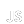

 **Please view the page on Light Theme for a better experience**  
 **This page will be updated soon!**
 

  

- - Learning  **Data Structures and Algorithms (DSA)**

- - Website: [https://sarbeswar.tech](https://sarbeswar.tech)

- - Reach me at:  **mail@sarbeswar.tech**

- - Resume:  [https://sarbeswar.tech/resume](https://sarbeswar.tech/resume)

<h3 align="left">Connect with me:</h3>

<h3 align="left">Languages and Tools:</h3>

 
  
   
  
 
   
  
   
   
  

  
   
  
  
 
 

<h3 align="left">Buy me a Coffee:</h3>

  

<picture>
  <source media="(prefers-color-scheme: dark)" srcset="https://raw.githubusercontent.com/tobiasmeyhoefer/tobiasmeyhoefer/output/github-snake-dark.svg" />
  <source media="(prefers-color-scheme: light)" srcset="https://raw.githubusercontent.com/tobiasmeyhoefer/tobiasmeyhoefer/output/github-snake.svg" />
  
</picture>